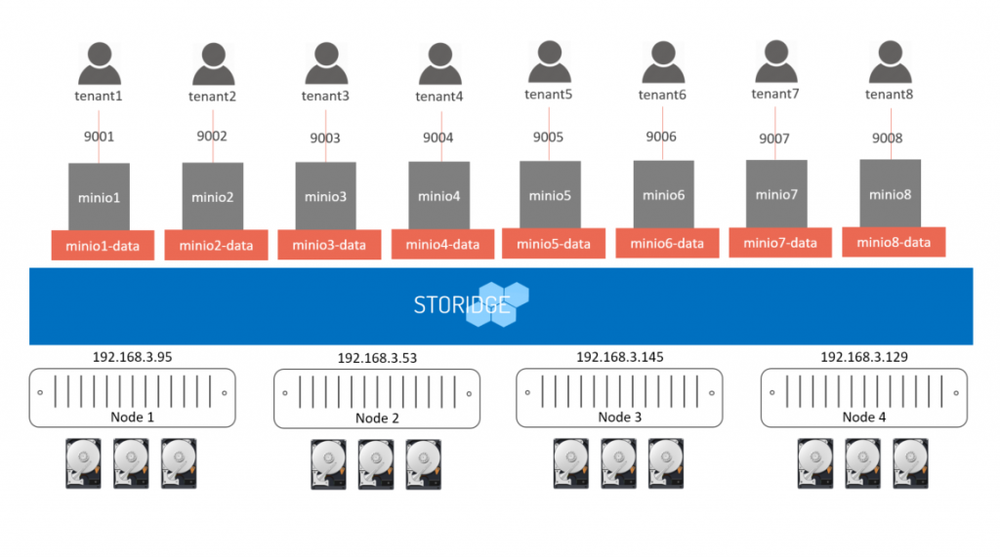
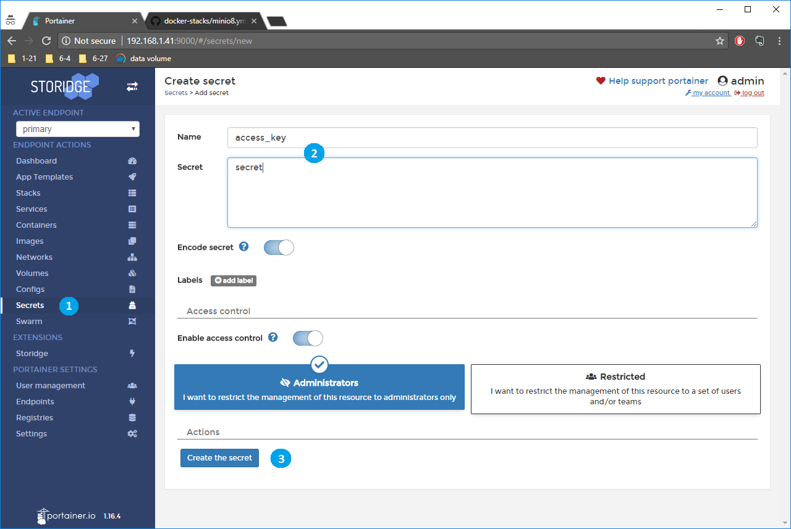
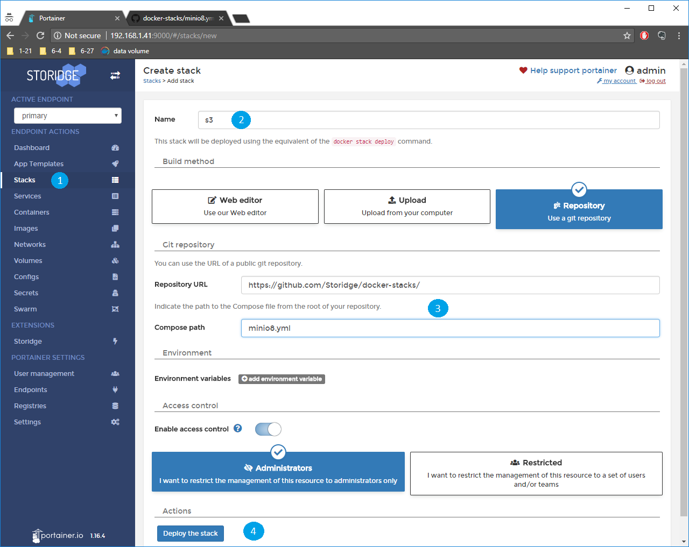
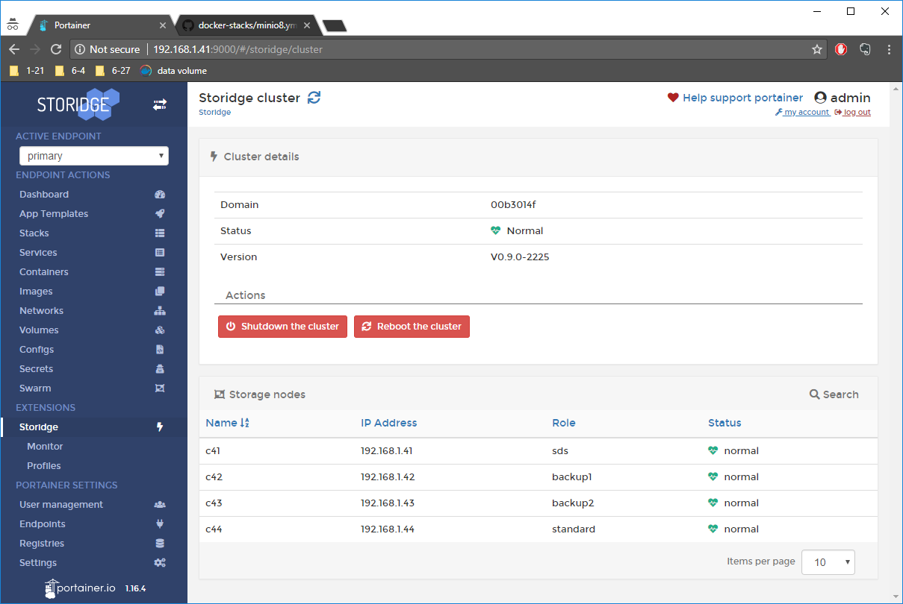

# Cloud Scale Minio With CIO

[Minio](https://minio.io/) is a popular object storage server compatible with [Amazon S3 API](https://docs.aws.amazon.com/AmazonS3/latest/API/Welcome.html). It is suited for storing unstructured data such as photos, videos, log files, backups and container images. 

As a cloud-native application that is designed to easily scale on orchestrated platforms, Minio is an excellent fit for multi-tenant environments that need isolated and highly available object storage for each tenant. 

In this recipe we use a Docker Stack file to deploy eight Minio instances with individual CIO volumes on a Swarm cluster. The volumes provisioned for the Minio instances benefit from the redundancy and performance isolation capabilities of the CIO storage layer. With support for up to 4095 volumes per node, the combination of Minio and CIO enable highly efficient use of resources to support more tenants per node.

## **Prerequisites**

- Familiarity with [Docker Stack](https://docs.docker.com/docker-cloud/apps/stacks/).

- CIO installed on your machine. Install from [here](http://storidge.com/docs/installing-developer-release/). 
  ​

## **Create Docker secrets for Minio**

1.  Select Secrets from the left panel and click 'Add secret'
2. Enter key name 'access_key' with secret 'secret'. 
3. Create the secret
4. Repeat step 2 and 3 for key name 'secret_key' and secret 'mysecret'

## **Run Minio on Docker Stack**

1. Select Stacks from the left panel and click 'Add stack'
2. Enter the stack name and select the 'git Repository' build method
3. Enter url [https://github.com/storidge/docker-stacks](https://github.com/storidge/docker-stacks) and name of the example compose file 'minio8.yml'. 
4. Click 'Deploy the stack' and Docker will pull the Minio image and CIO will create the data volumes using the pre-defined MINIO profile. 

The Minio instances are now available on the cluster at ports 9001 to 9008, and are accessible from any IP address in the cio cluster. 

Display the node IPs by selecting the Storidge extension on the left panel.  

In the example above, point the browser at any of the IP addresses, e.g. http://192.168.1.41:9001 to access the first Minio object storage server. 

Login in with access key "secret" and secret key "mysecret" configured earlier. 

#### Notes

- This example created 8 Minio instances. To add new Minio services:
  1. Copy the service definition and change the name of the new service to avoid naming conflicts
  2. Add a volume in volumes section, and update the volume name to avoid naming conflicts
  3. Update the port number to expose for the new service
- The Docker stack exposed the Minio services on ports 9001 to 9008 so multiple services can run on a cluster
- The example used the same access key and secret key for all instances. Assign different keys for each Minio instance as appropriate. 
