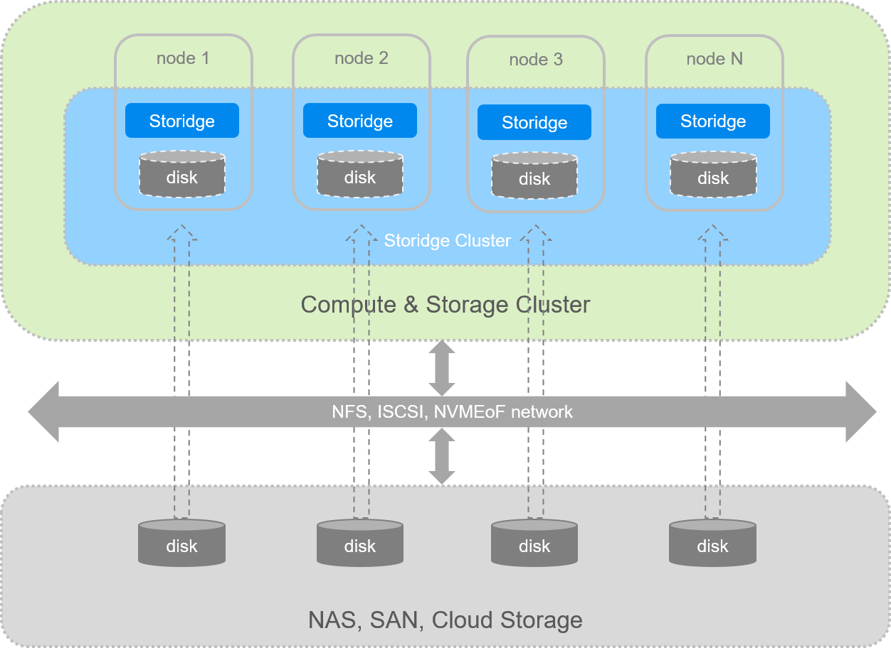

# Overview

## Storage abstraction layer

Storidge provides persistent storage for stateful applications. Our CIO software aggregates storage devices from a cluster of nodes into a shared capacity and performance pool. Docker sees the storage pool as an abstraction layer from which volumes are created for containers and services.

Capacity and performance can be scaled by adding new nodes to or removing existing nodes from the cluster. The Storidge software runs hyperconverged with Docker on cloud, virtual machines or bare metal servers. Storidge can also operate as an external scale-out storage cluster.

Volumes created by Storidge are:
- protected from hardware and node failures through network RAID
- writes are synchronous and strongly consistent
- performant with data distributed across multiple nodes and drives
- highly available with storage orchestration built-in
- provisioned programmatically in native Docker environment

## Docker integration

Docker integrates with external storage systems through the [volume plugin API](https://docs.docker.com/engine/extend/plugins_volume/). The API enables volumes to be natively provisioned in a Docker environment and then attached to an application running in a container or service.

The Storidge installation package installs a v2 volume plugin for Docker version 1.13.0 and above. The volume plugin enables request for storage to be passed to the CIO software whether from a [docker run](https://docs.storidge.com/docker_volumes/volumes_for_containers.html), [docker service create](https://docs.storidge.com/docker_volumes/volumes_for_services.html), [docker volume create](https://docs.storidge.com/docker_volumes/volumes.html) command or [Docker Compose](https://docs.storidge.com/docker_volumes/volumes_for_docker_compose.html) file.

For Docker Enterprise (EE), Storidge provides both a volume plugin and CSI driver to support both Swarm and Kubernetes modes.

## Deployment configurations

Docker works with the assumption that a Docker Volume is a local directory on a node where the container or service is running. There are three ways to deploy storage clusters for Docker stateful workloads:

1. Local attached storage on nodes - examples are ephemeral storage in cloud instances, or storage in server chassis. Storidge aggregates the attached devices from nodes into a storage pool. The Docker volumes created by Storidge are drawn from the storage pool, and appear as standard Linux devices that are local attached.

2. External storage attached to nodes - storage can be provisioned from external storage systems and attached to nodes. Examples are NFS shares from NAS or ISCSI LUNs from a SAN, and cloud storage. Storidge aggregates the attached devices into a storage pool, and the Docker volumes created are consumed by containerized apps as local attached volumes.

3. External volume accessed through storage protocol - Docker's storage drivers includes an NFS client for accessing NFS shares across a network, e.g. NFS share exported from an external NAS. Storidge's software enables any Storidge volume to be exported as an NFS share and accessed by Docker's NFS client. The NFS share can also be accessed by servers outside the cluster on the local subnet.

