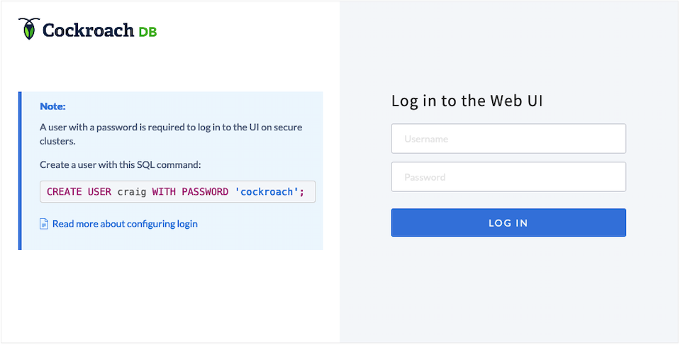
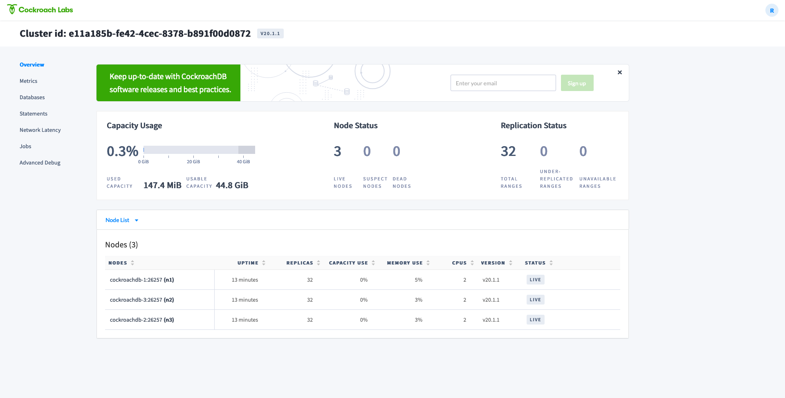
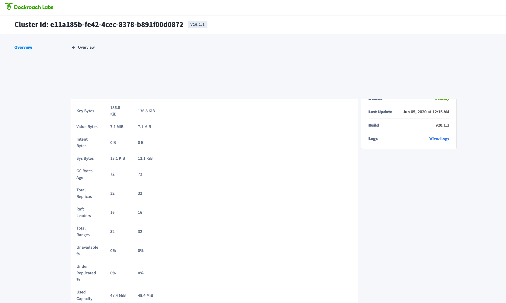

# Deploying CockroachDB on Storidge Volume with Docker Swarm

[CockroachDB](https://www.cockroachlabs.com/docs/stable/) is a distributed SQL database system that stores persistent data that allows for fast access. In this guide, we will deploy a CockroachDB cluster on Docker Swarm that uses Storidge CIO volume types. The guide will follow parts of Cockroach Labs' [guide](https://www.cockroachlabs.com/docs/stable/orchestrate-cockroachdb-with-docker-swarm.html).

## **Prerequisites**

- Storidge [CIO](https://guide.storidge.com/getting_started/install.html) cluster with at least 3 nodes.
- Familiarity with Docker volume and service creation.
- Root access enabled on your master node on your CIO and Docker Swarm cluster. Everything on this guide **will be run on the master node**.

## **Installation**

1. Make sure that your CIO cluster and Docker Swarm is running. We first create an overlay network for container communications purposes. Run the following command:

`sudo docker network create --driver overlay --attachable cockroachdb`

2. After making sure our network is up, we can install CockroachDB and create security resources.

```

$ # Get CockroachDB tarball:
wget https://binaries.cockroachdb.com/cockroach-v20.1.1.linux-amd64.tgz

...

$ # Extract the binary:
tar -xf cockroach-v20.1.1.linux-amd64.tgz  \
--strip=1 cockroach-v20.1.1.linux-amd64/cockroach

...

$ # Move the binary:
sudo mv cockroach /usr/local/bin/

```

## **Keys and Secrets Setup**

1. Create a `certs` directory on your to keep your CA key:

```

$ mkdir certs

```
```

$ mkdir my-safe-directory

```

2. Create the CA certificate and key:

```

$ cockroach cert create-ca \
--certs-dir=certs \
--ca-key=my-safe-directory/ca.key

```
```

$ ls certs

```
```

ca.crt

```

3. Create a Docker secret, or password, for `ca.crt`. It creates a secret called `ca-crt` and specifies where the CA certificate file is located.:

```

$ sudo docker secret create ca-crt certs/ca.crt

```

4. Now we can get to creating the ceritifates and keys for the first node in the cluster. In this guide, we will create **3 nodes**. Run the following:

```

$ cockroach cert create-node \
cockroachdb-1 \
localhost \
127.0.0.1 \
--certs-dir=certs \
--ca-key=my-safe-directory/ca.key

```
```

$ ls certs

```
```

ca.crt
node.crt
node.key

```

5. Next, we make secrets for the certificate and key that we just made:

```

$ sudo docker secret create cockroachdb-1-crt certs/node.crt

```
```

$ sudo docker secret create cockroachdb-1-key certs/node.key

```

6. Let's move on to creating the certificate and key for the second node. This time around, we add an `--overwrite` flag to replace the files that we created for our previous node:

```

$ cockroach cert create-node --overwrite \
cockroachdb-2 \
localhost \
127.0.0.1 \
--certs-dir=certs \
--ca-key=my-safe-directory/ca.key

```
```

$ ls certs

```
```

ca.crt
node.crt
node.key

```

7. Create the second node's Docker secrets for its certificate and key:

```

$ sudo docker secret create cockroachdb-2-crt certs/node.crt

```
```

$ sudo docker secret create cockroachdb-2-key certs/node.key

```

8. Repeat the node creation we did with the second node for the third node:

```

$ cockroach cert create-node --overwrite \
cockroachdb-3 \
localhost \
127.0.0.1 \
--certs-dir=certs \
--ca-key=my-safe-directory/ca.key

```
```

$ ls certs

```
```

ca.crt
node.crt
node.key

```

9. Repeat the Docker secret creation for the third node's certificate and key:

```

$ sudo docker secret create cockroachdb-3-crt certs/node.crt

```
```

$ sudo docker secret create cockroachdb-3-key certs/node.key

```

10. Create a client certificate and key for root user:

```

$ cockroach cert create-client \
root \
--certs-dir=certs \
--ca-key=my-safe-directory/ca.key

```

11. Repeat Docker secret creation for root certificate and key:

```

$ sudo docker secret create cockroachdb-root-crt certs/client.root.crt

```
```

$ sudo docker secret create cockroachdb-root-key certs/client.root.key

```

## **Volume and Service Creation**

Before we create our services for each node, we want to create the CIO volumes that each service will run on. Let's create three volumes for three nodes following the CIO [guide](https://guide.storidge.com/getting_started/docker_volumes.html):

```

$ docker volume create --driver cio --name cockroach1 --opt capacity=15
...
$ docker volume create --driver cio --name cockroach2 --opt capacity=15
...
$ docker volume create --driver cio --name cockroach3 --opt capacity=15

```

This creates three Docker volumes with Storidge's CIO driver with capacity 15GB. Their names are `cockroach1`, `cockroach2`, and `cockroach3`. Verify creation with `docker volume ls`:

```

DRIVER              VOLUME NAME
cio:latest          cockroach1
cio:latest          cockroach2
cio:latest          cockroach3
cio:latest          portainer_portainer

```

Run the following to create your first node:

```
$ sudo docker service create \
--replicas 1 \
--name cockroachdb-1 \
--hostname cockroachdb-1 \
--network cockroachdb \
--mount type=volume,source=cockroachdb-1,target=/cockroach/cockroach-data,volume-driver=cio:latest,src=cockroach1 \
--stop-grace-period 60s \
--publish 8080:8080 \
--secret source=ca-crt,target=ca.crt \
--secret source=cockroachdb-1-crt,target=node.crt \
--secret source=cockroachdb-1-key,target=node.key,mode=0600 \
--secret source=cockroachdb-root-crt,target=client.root.crt \
--secret source=cockroachdb-root-key,target=client.root.key,mode=0600 \
cockroachdb/cockroach:v20.1.1 start \
--join=cockroachdb-1:26257,cockroachdb-2:26257,cockroachdb-3:26257 \
--cache=.25 \
--max-sql-memory=.25 \
--logtostderr \
--certs-dir=/run/secrets

```

This creates the first node, `cockroachdb-1`, using the `volume-driver` called `cio:latest`. Specify `src=cockroach1` to assign the correct volume for it. Some explanations for each flag according to the CockroachDB docs are as follows:

- `sudo docker service create`: Creates a new service.
- `--replicas`: The number of containers controlled by our service. We set this value to `1` for each node since it's one CockroachDB node per local node.
- `--name`: The service name.
- `--hostname`: The hostname of the container. In this case, `cockroachdb-1`.
- `--network`: The overlay network for the container to join that we created earlier.
- `--mount`: Mounts a volume with the same `source` name as the service. We specify the `volume-driver` as `cio:latest` to put the node on Storidge volumes, and specify the name of the volume, `cockroach1`.
- `--stop-grace-period`: Setse a grace period for CockroachDB so it can shut down in time.
- `--publish`: Makes the Admin UI accessible at the IP of any instance running a swarm mode on port `8080`.
- `--secret`: Identify the secrets to use in securing the node. We created our secrets earlier in this guide. We must specify our ca-crt, node crt and key, and root crt and key.

Do the same with the next two nodes:

```

$ sudo docker service create \
--replicas 1 \
--name cockroachdb-2 \
--hostname cockroachdb-2 \
--network cockroachdb \
--stop-grace-period 60s \
--mount type=volume,source=cockroachdb-2,target=/cockroach/cockroach-data,volume-driver=cio:latest,src=cockroach2 \
--secret source=ca-crt,target=ca.crt \
--secret source=cockroachdb-2-crt,target=node.crt \
--secret source=cockroachdb-2-key,target=node.key,mode=0600 \
--secret source=cockroachdb-root-crt,target=client.root.crt \
--secret source=cockroachdb-root-key,target=client.root.key,mode=0600 \
cockroachdb/cockroach:v20.1.1 start \
--join=cockroachdb-1:26257,cockroachdb-2:26257,cockroachdb-3:26257 \
--cache=.25 \
--max-sql-memory=.25 \
--logtostderr \
--certs-dir=/run/secrets

```
```

$ sudo docker service create \
--replicas 1 \
--name cockroachdb-3 \
--hostname cockroachdb-3 \
--network cockroachdb \
--mount type=volume,source=cockroachdb-3,target=/cockroach/cockroach-data,volume-driver=cio:latest,src=cockroach3 \
--stop-grace-period 60s \
--secret source=ca-crt,target=ca.crt \
--secret source=cockroachdb-3-crt,target=node.crt \
--secret source=cockroachdb-3-key,target=node.key,mode=0600 \
--secret source=cockroachdb-root-crt,target=client.root.crt \
--secret source=cockroachdb-root-key,target=client.root.key,mode=0600 \
cockroachdb/cockroach:v20.1.1 start \
--join=cockroachdb-1:26257,cockroachdb-2:26257,cockroachdb-3:26257 \
--cache=.25 \
--max-sql-memory=.25 \
--logtostderr \
--certs-dir=/run/secrets

```

We can then verify that we've created all of the services successfully:

```

$ docker service ls

```
```

ID                  NAME                  MODE                REPLICAS            IMAGE                           PORTS
gajxrm81cn8m        cockroachdb-1         replicated          1/1                 cockroachdb/cockroach:v20.1.1   *:8080->8080/tcp
h1kzt23l6iyr        cockroachdb-2         replicated          1/1                 cockroachdb/cockroach:v20.1.1
pbif0nafar79        cockroachdb-3         replicated          1/1                 cockroachdb/cockroach:v20.1.1
wnxpcgxbukfc        portainer_agent       global              4/4                 portainer/agent:latest
yl7x5yxagj85        portainer_portainer   replicated          1/1                 portainer/portainer:latest      *:9000->9000/tcp

```

Finally, we can initialize our cluster:

```

$ sudo docker run -it --rm --network cockroachdb --mount type=bind,source="$(pwd)/certs",target=/cockroach/certs,readonly cockroachdb/cockroach:v20.1.1 init --host=cockroachdb-1 --certs-dir=certs

```

This `docker run` command will run the `cockroach init` command against one of the nodes we created and initialize our cluster.

## **CockroachDB MySQL Configuration**

Now that our cluster has been initialized and is ready to go, we need to log in to our CockroachDB dashboard. Before we do this, we use CockroachDB's SQL client to create an account:

```

$ sudo docker run -it --rm --network cockroachdb --mount type=bind,source="$(pwd)/certs",target=/cockroach/certs,readonly cockroachdb/cockroach:v20.1.1 sql --host=cockroachdb-1 --certs-dir=certs

```

Create a `securenodetest database` with `CREATE DATABASE securenodetest`; and create a username and password with `CREATE USER <username> WITH PASSWORD <password>;` as follows:

```

#
# Welcome to the CockroachDB SQL shell.
# All statements must be terminated by a semicolon.
# To exit, type: \q.
#
# Server version: CockroachDB CCL v20.1.1 (x86_64-unknown-linux-gnu, built 2020/05/19 14:46:06, go1.13.9) (same version as client)
# Cluster ID: e11a185b-fe42-4cec-8378-b891f00d0872
#
# Enter \? for a brief introduction.
#
root@cockroachdb-1:26257/defaultdb> CREATE DATABASE securenodetest;
CREATE DATABASE

Time: 137.093159ms

root@cockroachdb-1:26257/defaultdb> CREATE USER roach WITH PASSWORD 'admin';
CREATE ROLE

Time: 412.04257ms

```

Exit with `CTRL-D`, `CTRL-C` or type `\q` in the shell. We are now ready to access the dashboard and monitor the cluster.

## **Dashboard Access**

Open your browser and to to `https://<any node's external IP address>:8080`. You will be directed to the following login screen, where you can enter the username and password you created.



We arrive at the dashboard, where we can monitor the clusters we created. Note that there are the three nodes that we created on the home page.



Clicking on `cockroachdb-1` node gives us the following. The user can then monitor its status.




## **Teardown**

To first shutdown the cluster, we simply remove the node services and the volumes associated with them:

```
$ sudo docker service rm cockroachdb-1 cockroachdb-2 cockroachdb-3
...
$ docker volume rm cockroach1 cockroach2 cockroach3

```

Next, remove the secrets that we created: 

```

$ docker secrets ls

```
```

ID                          NAME                   DRIVER              CREATED             UPDATED
xejm7w9ctb3pdua2lv55dqcal   ca-crt                                     3 seconds ago       3 seconds ago
kv7c1we4ud9s4lmu8qgkbpqh2   cockroachdb-1-crt                          7 minutes ago       7 minutes ago
j8fu64n05x3h5l5okeplf466c   cockroachdb-1-key                          7 minutes ago       7 minutes ago
aume3g9mgcz0hfrudhjikqbgk   cockroachdb-2-crt                          6 minutes ago       6 minutes ago
37snguo2cu125iqhzb9gnjoxi   cockroachdb-2-key                          6 minutes ago       6 minutes ago
j5dz36vtuqmfhol03bpvd8k14   cockroachdb-3-crt                          4 minutes ago       4 minutes ago
gu8srmbk9joslfsphxc230z0z   cockroachdb-3-key                          4 minutes ago       4 minutes ago
p3jjoemqdv1wh7i87j2x7q1lt   cockroachdb-root-crt                       4 minutes ago       4 minutes ago
mcvgi14e8d7o7jvrb90k5ogyg   cockroachdb-root-key                       4 minutes ago       4 minutes ago

```
```

$ docker secrets rm ca-crt cockroachdb-1-crt cockroachdb-1-key cockroachdb-2-crt cockroachdb-2-key cockroachdb-3-crt cockroachdb-3-key cockroachdb-root-crt cockroachdb-root-key

```

Verify that there are no more instances of the secrets, volumes, or services that were created. Finally, we can remove the certs and safe directory with `rm -rf certs` `rm -rf my-safe-directory`.

