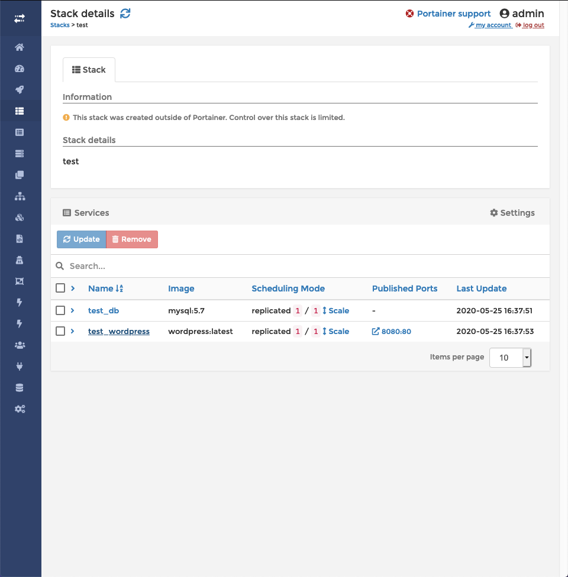

# Deploying Wordpress and MySQL with Storidge on Docker Swarm

Docker Swarm can be used to deploy stateful web applications. One of the more simpler types of applications we can deploy on Docker Swarm with Storidge is Wordpress. Previously mentioned in the [Docker Swarm](https://docs.storidge.com/docker_volumes/volumes_for_docker_compose.html) section, this guide will show how to use Docker to set up Wordpress with a MySQL database on a Storidge volume.

## Prerequisites

Have Storidge CIO software installed on your machine. Install from [here](https://guide.storidge.com/getting_started/install.html) and set up a cluster.

Make sure your nodes are running with `cio node ls` and Portainer service is working with `docker service ps portainer`. Open up Portainer by going to your master node IP address at port 9000.

## Setup

The example stack file below shows two services; a MySQL database (key db:) and WordPress (key wordpress:). The MySQL service will use volume mysql-data to persist data which is accessed inside the container at path /var/lib/mysql. Default usernames and passwords will be specified in the `environment` portions of the file.

A volume specification (volumes:) at the end of the wordpress-mysql.yml file completes the definition of the volume. Note the key mysql-data names the volume and calls the Storidge cio volume plugin. Under driver options, the volume definition also specifies a MYSQL profile to be used for creating the volume. The [profile](https://guide.storidge.com/getting_started/why_profiles.html) is a compact way for declaring the attributes of a volume.

```
# wordpress-mysql.yml
version: '3'
services:
  db:
    image: mysql:5.7
    volumes:
        # Pass volume named mysql-data to mysql container
      - "mysql-data:/var/lib/mysql"
    restart: always
    environment:
      MYSQL_ROOT_PASSWORD: wordpress
      MYSQL_DATABASE: wordpress
      MYSQL_USER: wordpress
      MYSQL_PASSWORD: wordpress

  wordpress:
    depends_on:
      - db
    image: wordpress:latest
    links:
      - db
    ports:
      - "8080:80"
    restart: always
    environment:
      WORDPRESS_DB_HOST: db:3306
      WORDPRESS_DB_PASSWORD: wordpress

# Add volumes definition to create volume mysql-data referenced above
volumes:
  mysql-data:
    driver: cio
    driver_opts:
      profile: "MYSQL"
```

## Deployment, Usage, and Teardown

After you have created the YAML file, deploy by running `docker stack deploy -c wordpress-mysql.yml test`.

You will see service `test_db` and `test_wordpress` in your stacks tab in Portainer.



Wordpress is accessible on your host node at port 8080. Log in and access your personal Wordpress dashboard, or create a new account from there.

You can remove the service from your stacks tab by clicking the checkbox next to `test_wordpress` and `test_db` and clicking the Remove button. Using Portainer to remove the service is a useful abstraction that saves the time of having to run a `docker service rm`.
