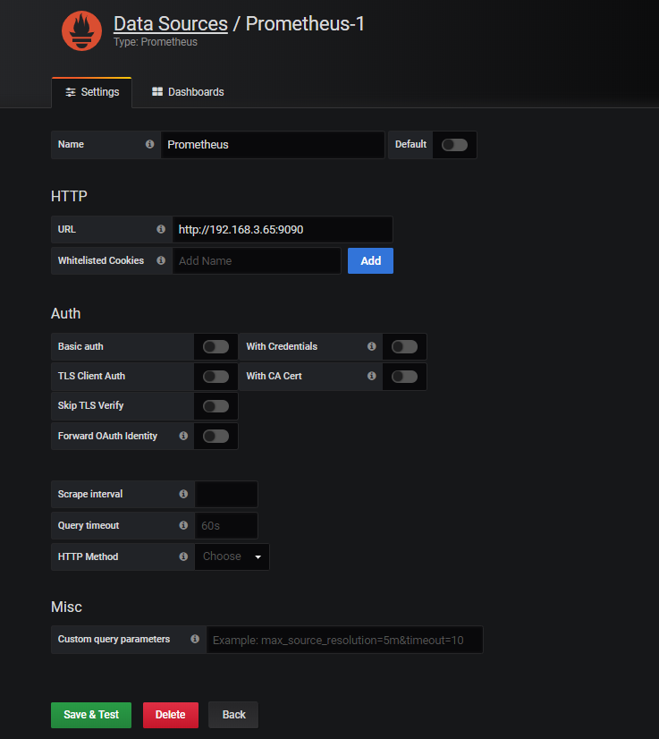
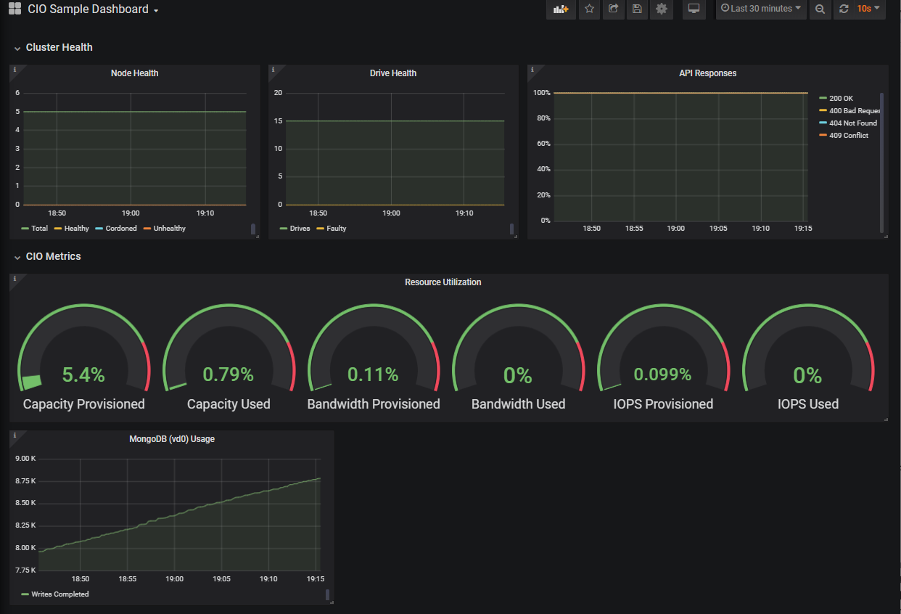

# Visualize Storidge cluster metrics with Grafana

Grafana is often paired with Prometheus to visualize metrics. Where Prometheus gathers time-series data, Grafana visualizes it.

After [setting up Prometheus](https://docs.storidge.com/integrations/prometheus.html) to serve metrics for a Storidge cluster, follow steps below to configure Grafana.

<h2>Start Grafana</h2>

Start Grafana with the following docker run command:
```
docker run --restart=always --name grafana -d -p 3000:3000 grafana/grafana
```

<h2>Configure Prometheus as data source</h2>

Login to Grafana by navigating to IP address of your server at port 9090, i.e. http://<IP_ADDRESS>:3000. Use default account admin/admin.

Click the Add data source icon and select Prometheus. You are asked to configure your data source.

In the screen below, leave 'Prometheus' as the data source name, and add url of the Prometheus server in the HTTP section, e.g. http://192.168.3.65:9090. Click on 'Save & Test' to exit.



<h2>Import dashboard</h2>

Next import an [example Grafana dashboard](https://grafana.com/grafana/dashboards/11359) provided by Storidge. From the dropdown menu on left column, go to Create/Import.

Enter '11359' in the Grafana.com Dashboard field. Click 'Upload .json file' to add the sample dashboard. In the Prometheus field, select the data source named 'Prometheus' created above, then click Import.

Your dashboard will look like the following.


