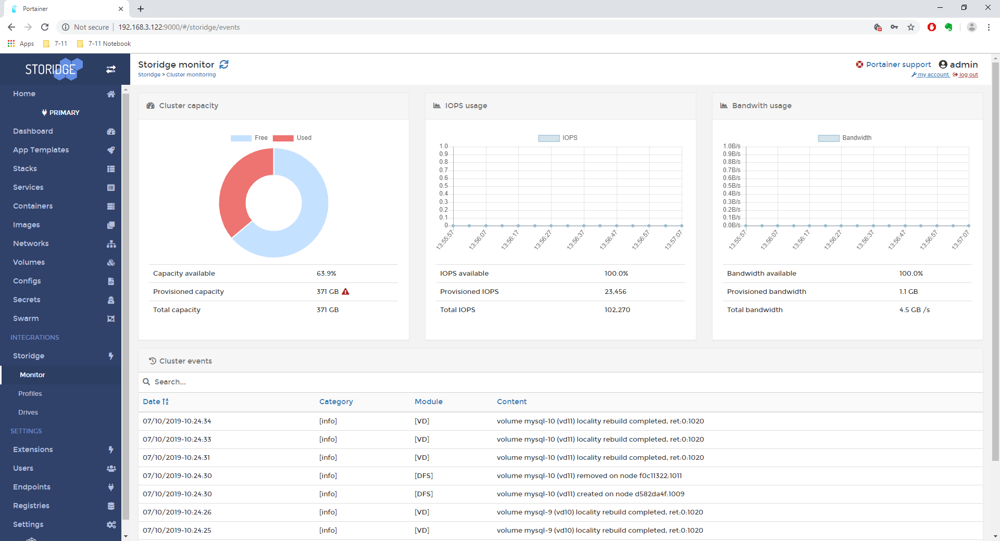

# Portainer

Our prior beta integration with Portainer.io has now reached GA. See the Portainer announcement [here](https://www.portainer.io/2019/06/portainer-release-1-21-0/) and Storidge's 1.0 release announcement [here](https://storidge.com/blog/announcing-community-edition-1-0/).

<h3>What's in the integration</h3>

With this integration, the Portainer service will automatically detect the Storidge cluster and present an enhanced interface for you to manage the Storidge environment. The Storidge capabilities available within Portainer include: 

- persistent storage for stateful applications
- define profiles to consistently create persistent volumes
- point-in-time copies of data with snapshots 
- auto capacity expansion for volumes 
- automatic data locality
- performance guarantees for apps (bare metal with flash memory)
- shared volumes for Docker stacks 
- shared volumes with NFS 
- monitor storage metrics (capacity, performance)
- monitor cluster events 
- distributed block storage with network RAID
- manage cluster status (reboot, shutdown, maintenance mode)
- manage physical disks (adding, removing)

<h3>Community Edition</h3>

The Community Edition of Storidge includes a license to provision up to 10TB of storage. This generous limit for the Portainer and Docker community should cover most deployments. This license allows up to 5 nodes (Docker hosts with disks) for production capable clusters. 

::: tip
For production deployments, a minimum of four nodes is recommended
:::

To simplify the user experience, after initialization of the Storidge cluster, the Community Edition was developed to form a Docker Swarm cluster, and then automatically launch a Portainer service. 

The only thing you have to do is connect to the Portainer dashboard, set the admin credentials and start launching applications. 

<h3>Portainer Volume</h3>

As part of the initialization, the Storidge software will automatically create a 'portainer' volume to preserve Portainer state. 

In the event of a node failure, the portainer volume will be moved by the Storidge storage orchestrator to the new node where the Portainer service is rescheduled. This ensures that the Portainer dashboard is always available. 

<h3>Get Started</h3>

Ready to get started? Head over to [guide.storidge.com](https://guide.storidge.com/), run [Install cio](https://guide.storidge.com/getting_started/install.html) to download and install the software, then finish [Initialize cluster](https://guide.storidge.com/getting_started/initialize.html) to start running a cluster that's ready for stateful applications. 

Contact us via our [Slack channel](http://storidge.com/join-cio-slack/) for support, and visit our partners at [Portainer.io](https://www.portainer.io/) for [documentation](https://portainer.readthedocs.io/en/stable/) on the UI.
 

