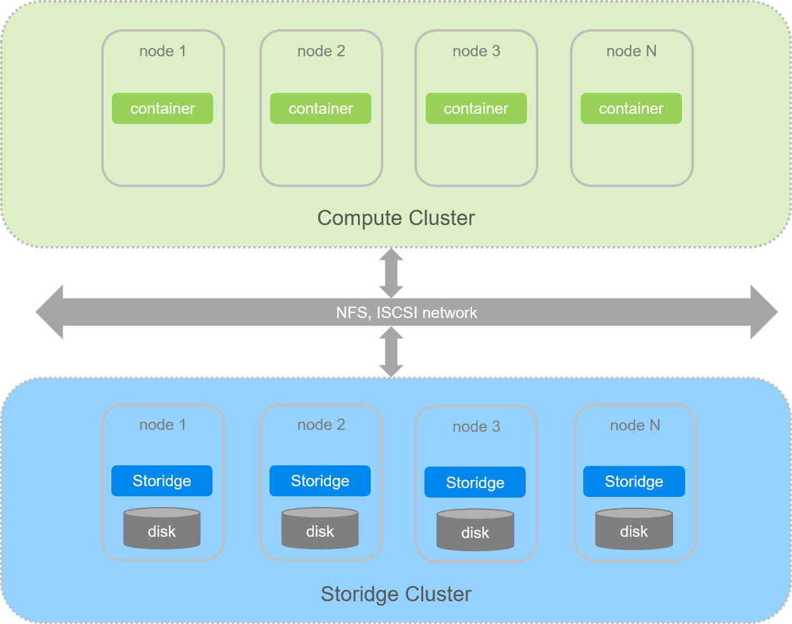

# Overview

## Storage abstraction layer

Storidge provides persistent storage for stateful applications. Our CIO software aggregates storage devices from a cluster of nodes into a shared capacity and performance pool. Kubernetes sees the storage pool as an abstraction layer from which volumes are created for containers and pods.

Capacity and performance can be scaled by adding new nodes to or removing existing nodes from the cluster. The Storidge software runs hyperconverged with Kubernetes on cloud, virtual machines or bare metal servers. Storidge can also operate as an external scale-out storage cluster.

Volumes created by Storidge are:
- protected from hardware and node failures through network RAID
- writes are synchronous and strongly consistent
- performant with data distributed across multiple nodes and drives
- highly available with storage orchestration built-in
- provisioned programmatically in native Kubernetes environment

Storidge volumes can be dynamically created or pre-provisioned, and then referenced inside a Kubernetes [Pod](https://kubernetes.io/docs/concepts/workloads/pods/pod/).

## Kubernetes integration

Kubernetes introduced [Container Storage Interface](https://github.com/container-storage-interface/spec/blob/master/spec.md) (CSI) support as alpha in v1.9 and moved to beta in v1.10. CSI defines a standard interface for container orchestration systems to integrate external storage systems, such as Storidge, and provision volumes for container workloads.

The Storidge software installation package installs a [CSI driver](https://hub.docker.com/_/storidge-csi-driver) for Kubernetes v1.14 and above. Once deployed, the CSI driver (aka provisioner) forwards requests from `PersistentVolumeClaims` to the Storidge CIO software which provisions and automatically attaches the volume to the node where the pod is scheduled to run.

## Storage configurations

There are three ways to provision storage to Kubernetes workloads as persistent volumes:

1. Local attached storage on nodes - examples are ephemeral storage in cloud instances, or storage in server chassis. Storidge aggregates the attached devices from nodes into a storage pool. The persistent volumes created by Storidge are drawn from the storage pool, and appear as standard Linux devices that are local attached.

2. External storage attached to nodes - storage can be provisioned from external storage systems and attached to nodes. Examples are NFS shares from NAS, ISCSI LUNs from a SAN, and cloud storage. Storidge aggregates the attached devices into a storage pool, and the persistent volumes created are consumed by containerized apps as local attached storage.

3. External volume accessed through storage protocol - storage drivers in Kubernetes include an NFS client for accessing NFS shares across a network, e.g. NFS share exported from an external NAS. Storidge's software enables any Storidge volume to be exported as an NFS share and accessed by any NFS client. The NFS share can also be accessed by servers outside the cluster on the local subnet.

## Volumes

Kubernetes uses a [volume abstraction](https://kubernetes.io/docs/concepts/storage/volumes/) to share files between containers in a pod, and to provide data persistence across pod restarts. The shared volume is a directory which is accessible to each container in the Pod.

There are many types of volumes, and a Pod can use any number of them at the same time. How a directory comes to be, the storage attributes, and access protocols are determined by the volume type used.

To use a volume, a Pod specifies the volume type, and the mountpoint in one or more containers.

## PV, PVC and Storage Class

Kubernetes manages resources in a cluster through abstraction layers. For storage, persistent volumes and persistent volume claims are objects used to represent and request storage resources. The persistent volume points to the storage resource where data for the Pod is actually persisted.

**Persistent Volume (PV)**

A [persistent volume](https://kubernetes.io/docs/concepts/storage/persistent-volumes/) is an abstraction describing a storage resource in the cluster. PVs can be pre-provisioned (static provisioning) or dynamically provisioned. The lifecycle of a PV is independent of the Pod.

**Persistent Volume Claim (PVC)**

A persistent volume claim is an abstraction representing a request for storage. A PVC represents a request for specific capacity, access mode and storage attributes. A Pod makes a request for storage resources through specs in a pod template (aka manifest).

**Storage Class**

While PVCs allow Pods to consume storage resources, it is common to request volumes with varying attributes for different applications. Kubernetes uses the [storage class](https://docs.storidge.com/kubernetes_storage/storage_classes.html) object to express the desired properties of a PV. This enables the underlying storage infrastructure to support and deliver different classes of service to applications.
