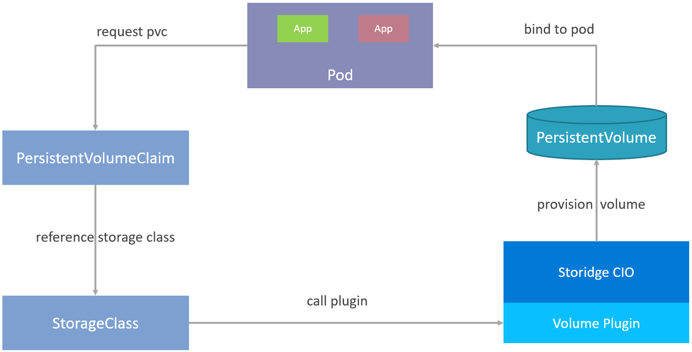

# Volumes

Storidge provides scalable and persistent storage for your Kubernetes cluster. Our CIO (continer I/O) software aggregates storage from a cluster of nodes into a global capacity and performance pool. The CIO software creates `storidgeVolumes` and allocates capacity and performance for containers and pods from this global resource.

Capacity and performance is scaled by adding new nodes to or removing existing nodes from the cluster. Storidge's CIO software runs hyperconverged with Kubernetes on both physical and virtual servers to enable consistent and repeatable deployments across public and private clouds.

The volumes created by the CIO software, `storidgeVolumes`:

- protected from hardware and node failures through automatic replication
- writes are synchronous and strongly consistent
- highly performant with data distributed across multiple nodes and drives
- managed through profiles and storage classes to greatly simplify operations
- provisioned programmatically in seconds through a scheduler or orchestration system

A `storidgeVolume` can be dynamically created through Kubernetes. It can also be pre-provisioned and then referenced inside a Kubernetes [Pod](https://kubernetes.io/docs/concepts/workloads/pods/pod/).

## **Kubernetes Storage**

Kubernetes uses a [volume](https://kubernetes.io/docs/concepts/storage/volumes/) abstraction to share files between containers in a pod and to provide data persistence across pod restarts. A Kubernetes volume is a directory which is accessible to containers sharing a Pod. There are many types of volumes, and a Pod can use any number of them at the same time. How a directory comes to be, properties of the media and access protocols are determined by the volume type used.

Kubernetes introduced [Container Storage Interface](https://github.com/container-storage-interface/spec/blob/master/spec.md) (CSI) support as alpha in v1.9 and moved to beta in v1.10. CSI defines a standard interface for container orchestration systems to integrate external storage systems and provision volumes for container workloads.

Volumes provisioned through CSI are not directly referenced from a pod. Instead, users manage storage in Kubernetes through three cluster resources:

- [PersistentVolumeClaim](https://kubernetes.io/docs/concepts/storage/persistent-volumes/) (PVC), a request for storage
- PersistentVolume (PV), storage with lifecycle independent of any pod
- StorageClass, enables delivering storage with different classes of service

For dynamically provisioned volumes, pods make requests for storage through a `PersistentVolumeClaim`. The definition file (usually in yaml format) for a `PersistentVolumeClaim` references a `StorageClass`, which calls the volume plugin to provision a `PersistentVolume` with a specified set of attributes. Once created, the `PersistentVolume` is then bound to the pod that made the request.

Figure 1. Dynamic provisioning of a persistent volume

The software installation package installs a [Storidge CSI driver](https://hub.docker.com/_/storidge-csi-driver) for Kubernetes v1.14 and above. Once deployed, the volume plugin (aka provisioner) forwards requests from `PersistentVolumeClaims` to the CIO software which provisions and automatically attaches the `storidgeVolume` to the node where the pod is scheduled to run.

Storidge supports multiple volume types in a Kubernetes cluster, including NFS and ISCSI.
